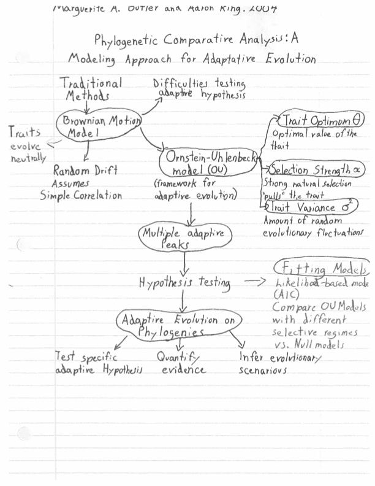

# Apr 21

## Phylogenetic Comparative Methods - Continuous Characters

All papers and powerpoints in \[[Shared Drive](https://drive.google.com/drive/u/0/folders/1ftgXSMARxGUhPHBGKkJN48lKBJC6Ji-m)\]

### Intro to Comparative Methods powerpoint

The comparative method is one of the oldest tools in biology. By comparing species that differ in some interesting way, for example ecology or habit, and exploring the variation in phenotype, we can try to infer the structure-function relationship, or even the purpose or function of some phenotype. Modern methods take account of phylogeny in the comparison when they want to make a statement about evolution. Pay attention to the model of evolution (either explicit or implied).

43. __Felsenstein, J. 1985__ Phylogenies and the comparative method. American Naturalist 125:1-15. **map:Taren**

Felsenstein 1985 is a highly influential paper - the second most cited paper in evolutionary biology of all time! When it came out there were many other simultaneous "phylogenetic comparative methods" papers, but this one really got people to realize that it was important to take phylogeny into account. It brought to light that we could use the Brownian motion model of evolution to study character evolution.

#### Concept Map by Taren

#### Questions:

1. 

44. __Butler, M. A., and King, A. A. 2004__ Phylogenetic comparative analysis: a modeling approach for adaptive evolution. American Naturalist 164:683-695.  **map:Manuel**

This is my paper with Aaron King. When everyone was thinking about "correcting for phylogeny", Thomas Hansen 1997 proposed using the Ornstein-Uhlenbeck model for modeling adaptive evolution along phylogenies. We showed how to apply this method to maximize tests for adaptive evolution along a phylogeny using the method of model selection. By expressing our biologically-inspired hypotheses as alternative evolutionary models, we can see if the data have enough power to support various hypotheses of evolutionary process that would predict different phenotypic outcomes.  

#### Concept Map by Manuel

#### Questions:

1. 

